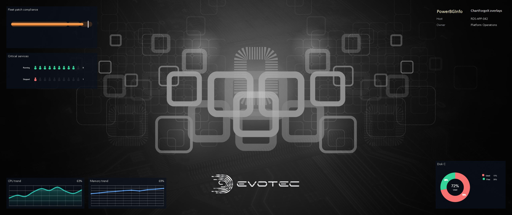
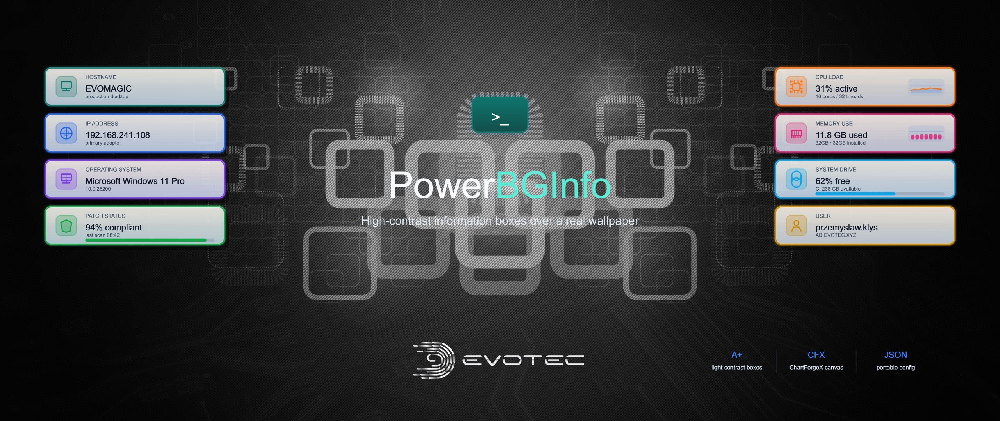
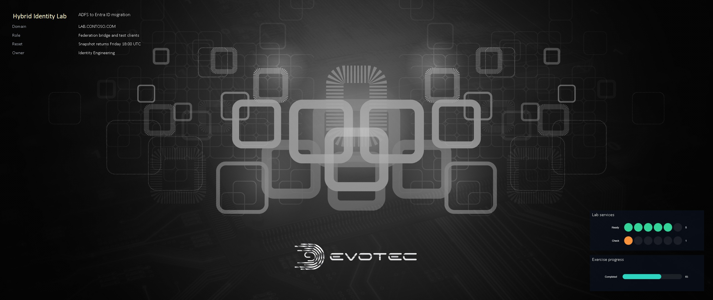
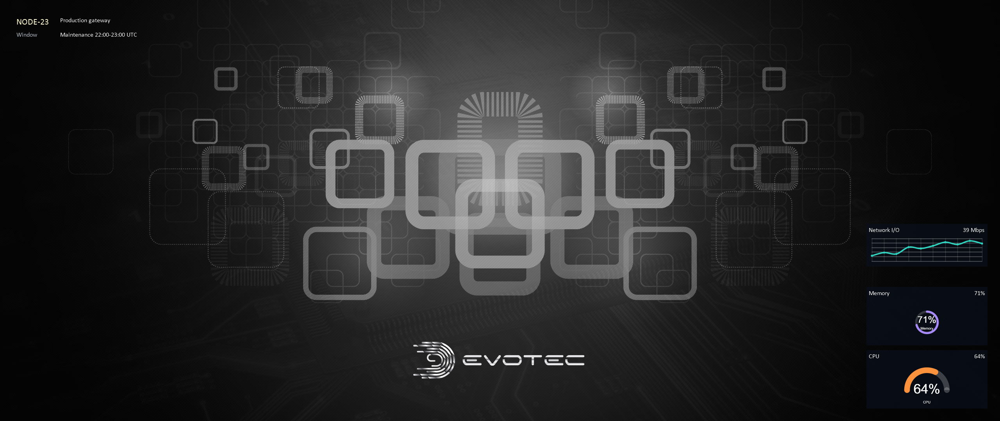
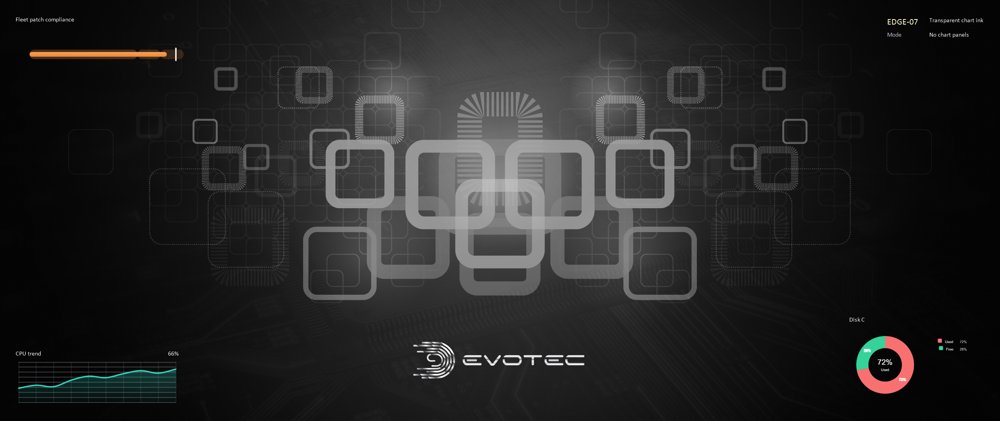
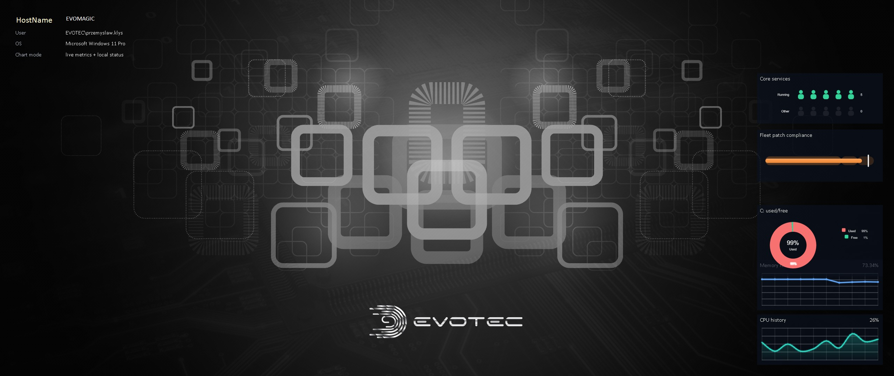
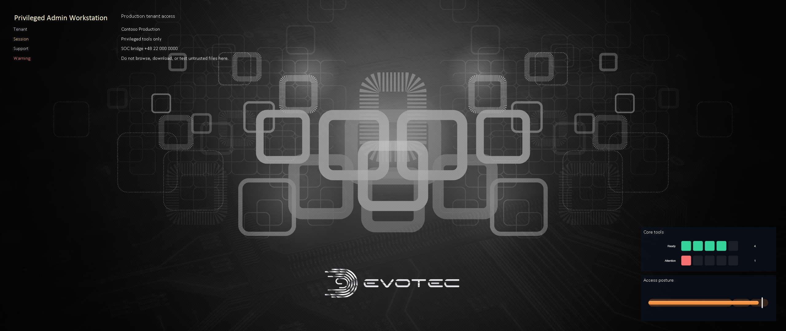
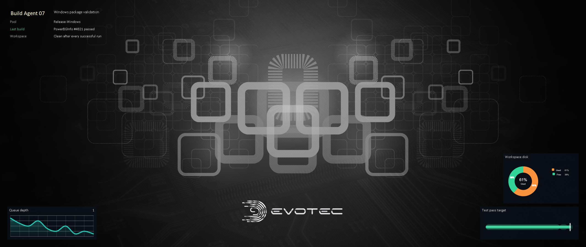
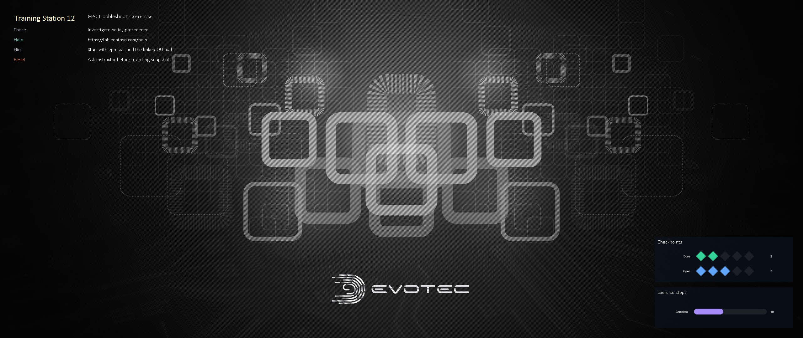

<p align="center">
  <a href="https://github.com/EvotecIT/PowerBGInfo/actions/workflows/test-dotnet.yml"></a>
  <a href="https://github.com/EvotecIT/PowerBGInfo/actions/workflows/test-powershell.yml"></a>
  <a href="https://codecov.io/gh/EvotecIT/PowerBGInfo"></a>
  <a href="https://www.powershellgallery.com/packages/PowerBGInfo"></a>
  <a href="https://www.powershellgallery.com/packages/PowerBGInfo"></a>
  <a href="https://github.com/EvotecIT/PowerBGInfo"></a>
</p>

<p align="center">
  <a href="https://www.powershellgallery.com/packages/PowerBGInfo"></a>
  <a href="https://github.com/EvotecIT/PowerBGInfo"></a>
  <a href="https://github.com/EvotecIT/PowerBGInfo"></a>
  <a href="https://www.powershellgallery.com/packages/PowerBGInfo"></a>
</p>

<p align="center">
  <a href="https://twitter.com/PrzemyslawKlys"></a>
  <a href="https://evotec.xyz/hub"></a>
  <a href="https://www.linkedin.com/in/pklys"></a>
  <a href="https://evo.yt/discord"></a>
</p>

**PowerBGInfo** creates Windows desktop and logon-screen backgrounds from PowerShell.
Use it to put machine identity, support details, user/session context, operational status, charts, and small topology diagrams directly on the wallpaper.

You can read about this project on this [blog post](https://evotec.xyz/powerbginfo-powershell-alternative-to-sysinternals-bginfo/) that tells a little backstory and shows few things.

## What it can do

- Generate a wallpaper from a normal PowerShell script.
- Use built-in values such as host name, user name, OS details, CPU, RAM, BIOS, and disk information.
- Add custom values from your own PowerShell, CIM/WMI, registry, AD, APIs, or RMM data.
- Place information in corners, center positions, or explicit screen coordinates.
- Wrap long values such as AD computer descriptions with `-ValueWrapWidth`.
- Apply output to the current user, all users, the logon/lock screen, or just write a file.
- Preserve the current Windows wallpaper slideshow by rendering one BGInfo image per slideshow source.
- Handle solid-color desktops when Windows has no wallpaper file.
- Add transparent ChartForgeX charts and topology diagrams on top of real wallpapers.
- Export JSON configurations when you need a portable deployment artifact.

## Installation

Install from [PowerShell Gallery](https://www.powershellgallery.com/packages/PowerBGInfo):

```powershell
Install-Module PowerBGInfo -Force -Verbose
```

PowerBGInfo no longer requires separate PowerShell module installs for helper modules such as `DesktopManager` or `ImagePlayground`.
When there's an update, use the same `Install-Module` command again.

## Quick start

Create a simple generated wallpaper:

```powershell
New-BGInfo -MonitorIndex 0 {
    New-BGInfoValue -BuiltinValue HostName -Color Red -FontSize 24
    New-BGInfoValue -BuiltinValue FullUserName -Name 'User'
    New-BGInfoValue -BuiltinValue OSName -Name 'OS'
    New-BGInfoValue -BuiltinValue CpuName -Name 'CPU'
    New-BGInfoValue -BuiltinValue RAMSize -Name 'Memory'
} -ConfigurationDirectory 'C:\ProgramData\PowerBGInfo' -WallpaperFit Fill
```

Generate an image file without changing the current wallpaper:

```powershell
New-BGInfo -MonitorIndex 0 -Target File {
    New-BGInfoValue -Name 'Machine' -Value $env:COMPUTERNAME
    New-BGInfoValue -Name 'Support' -Value 'helpdesk@contoso.com'
} -ConfigurationDirectory 'C:\Temp\PowerBGInfo' -OutputFileName 'Preview.png' -BackgroundColor Black
```

Wrap long values:

```powershell
$description = 'Long computer description from AD, inventory, RMM, CMDB, or any other source.'

New-BGInfo -MonitorIndex 0 -ValueWrapWidth 420 {
    New-BGInfoValue -Name 'Description' -Value $description -Color White -ValueColor LightGray
} -ConfigurationDirectory 'C:\ProgramData\PowerBGInfo'
```

Apply the same generated wallpaper for existing users and the default profile used by new users:

```powershell
New-BGInfo -MonitorIndex 0 -AllUsers {
    New-BGInfoValue -BuiltinValue HostName
    New-BGInfoValue -BuiltinValue OSName -Name 'OS'
} -ConfigurationDirectory 'C:\ProgramData\PowerBGInfo' -WallpaperFit Fill
```

Apply to both the desktop wallpaper and the Windows logon/lock screen:

```powershell
New-BGInfo -MonitorIndex 0 -Target Both {
    New-BGInfoValue -BuiltinValue HostName
    New-BGInfoValue -BuiltinValue OSName -Name 'OS'
} -ConfigurationDirectory 'C:\ProgramData\PowerBGInfo' -WallpaperFit Fill
```

`-AllUsers`, `-Target LogonScreen`, and `-Target Both` need elevation because they write system-level wallpaper settings.

## Example outputs








## Common scenarios

| Scenario | PowerBGInfo feature |
| --- | --- |
| Lab or demo VM identity | Built-in values, custom values, positioned text |
| Shared admin workstation | Support details, tenant/customer context, warning text |
| Build or test host | Charts for CPU, memory, disk, service status, and targets |
| Training room or kiosk | Exercise phase, machine number, URLs, reset hints |
| Terminal server / RDS | Per-session script runs for user-specific values |
| Fleet deployment | `-AllUsers`, JSON export, scheduled task/RMM execution |
| Logon screen branding | `-Target LogonScreen` or `-Target Both` |

## Operational notes

- Solid-color desktops: when no wallpaper file exists, PowerBGInfo renders a blank image using the desktop background color or `-BackgroundColor`.
- Wallpaper slideshows: when no explicit `-FilePath` is provided and Windows has a wallpaper slideshow configured, PowerBGInfo renders every slideshow source image into the configuration directory and restarts the slideshow with the generated images while preserving DesktopManager slideshow options and interval. Use `-DisableWallpaperSlideshow` when you want one static generated wallpaper instead.
- Refresh behavior: by default the wallpaper is refreshed to avoid Windows caching issues; use `-DisableWallpaperRefresh` only when you need the old behavior.
- All users: use `-AllUsers` elevated. Use `-ExcludeDefaultUserProfile` to skip the default profile.
- Logon screen: use `-Target LogonScreen` or `-Target Both` elevated.
- Terminal server / RDS: run PowerBGInfo in each user session when you need per-user values such as `FullUserName`.
- File output: use `-Target File` and `-OutputFileName` when you want a preview or an image for another deployment system.

## Known issues

PowerBGInfo works in Windows PowerShell 5.1 and PowerShell 7+.
There is a known problem when running the module in the VS Code PowerShell extension on Windows PowerShell 5.1. The same module works in the regular Windows PowerShell 5.1 console, Windows PowerShell ISE, and PowerShell 7+.

## PowerShell inline usage

You can also render everything inline from PowerShell when you're exploring or authoring a layout:

```powershell
New-BGInfo -MonitorIndex 0 {
    # Add computer name from a built-in value.
    New-BGInfoValue -BuiltinValue HostName -Color Red -FontSize 20 -FontFamilyName 'Calibri'
    # Add current user from a built-in value.
    New-BGInfoValue -BuiltinValue FullUserName -Name "FullUserName" -Color White
    New-BGInfoValue -BuiltinValue CpuName
    New-BGInfoValue -BuiltinValue CpuLogicalCores
    New-BGInfoValue -BuiltinValue RAMSize
    New-BGInfoValue -BuiltinValue RAMSpeed

    # Add a section label without a value.
    New-BGInfoLabel -Name "Drives" -Color LemonChiffon -FontSize 16 -FontFamilyName 'Calibri'

    # Add drive details from regular PowerShell data.
    foreach ($Disk in (Get-Disk)) {
        $Volumes = $Disk | Get-Partition | Get-Volume
        foreach ($V in $Volumes) {
            New-BGInfoValue -Name "Drive $($V.DriveLetter)" -Value $V.SizeRemaining
        }
    }
} -FilePath $PSScriptRoot\Samples\PrzemyslawKlysAndKulkozaurr.jpg -ConfigurationDirectory $PSScriptRoot\Output -PositionX 100 -PositionY 100 -WallpaperFit Center
```

You can export the same inline authoring flow to JSON by adding `-JsonPath` and, when you only want the config file, `-ExportOnly`.
Example output:


## More layout and output options

- `-TextPosition`, `-PositionX`, `-PositionY`, `-SpaceX`, and `-SpaceY` control where the text block is placed.
- `-UseScreenCoordinates` makes placement calculations match the monitor coordinate space.
- `-OutputFileName` controls the generated image name and path.
- `-DisableWallpaperSlideshow` forces static wallpaper output instead of preserving the active Windows slideshow.
- `-JsonPath` and `-ExportOnly` save reusable configuration without applying the wallpaper.
- `New-BGInfoChart`, `New-BGInfoTopology`, and `New-BGInfoVisualCanvas` add ChartForgeX-backed transparent overlays with optional chart history and reusable visual canvas boxes.

## Deployment recipes

Custom text works on both sides of the layout, so you can compute the left column yourself instead of relying only on builtin labels:

```powershell
$bgHostname = $env:COMPUTERNAME
$bgUsername = if ($user = (Get-CimInstance Win32_ComputerSystem).UserName) {
    $user.Split('\')[-1]
} else {
    'Unknown'
}

New-BGInfo -MonitorIndex 0 -Target File {
    New-BGInfoValue -Name $bgHostname -Value $bgUsername -Color LemonChiffon -ValueColor White -FontSize 24 -FontFamilyName 'Calibri'
    New-BGInfoValue -Name 'Support' -Value 'helpdesk@contoso.com'
}
```

Apply the generated wallpaper for existing profiles and the default profile used by new users:

```powershell
New-BGInfo -MonitorIndex 0 -AllUsers {
    New-BGInfoValue -BuiltinValue HostName
    New-BGInfoValue -BuiltinValue OSName -Name 'OS'
} -ConfigurationDirectory 'C:\ProgramData\PowerBGInfo'
```

Skip the default profile if you only want current user profiles updated:

```powershell
New-BGInfo -MonitorIndex 0 -AllUsers -ExcludeDefaultUserProfile {
    New-BGInfoValue -BuiltinValue HostName
} -ConfigurationDirectory 'C:\ProgramData\PowerBGInfo'
```

Apply to the logon/lock screen, or to both the desktop wallpaper and logon screen in one run:

```powershell
New-BGInfo -MonitorIndex 0 -Target Both {
    New-BGInfoValue -BuiltinValue HostName
    New-BGInfoValue -BuiltinValue OSName -Name 'OS'
} -ConfigurationDirectory 'C:\ProgramData\PowerBGInfo'
```

For Remote Desktop Session Host / terminal server scenarios, run PowerBGInfo in each user session when you need per-user values such as `FullUserName`. `-AllUsers` is best for staging the same generated wallpaper to many profiles, not for rendering unique user data offline.

On Windows 11 24H2, keep the default wallpaper refresh behavior enabled unless you have a specific reason to disable it. PowerBGInfo writes a temporary refresh file first to avoid Windows reusing a cached wallpaper path after relogon.

## Charts

PowerBGInfo can place ChartForgeX charts directly on the generated wallpaper. The chart itself is rendered as a transparent overlay, then composited into the final image, so it works well on real wallpapers without a heavy dashboard frame.


The example above is generated by `Examples/Run.BGInfo.ChartForgeX.ps1`. It combines:

- `Area` and `Line` charts for short performance trends.
- `Donut` with point labels, legend, palette, and center text.
- `Bullet` for compliance against a target with qualitative ranges.
- `Pictorial` for simple status counts.

For a smaller operational layout, use stacked charts anchored to one corner:



If you want the chart ink to melt into the wallpaper, omit `-BackgroundColor` on the chart or set it to `Transparent` / `'#00000000'`. The lines, labels, legend, grid, and data labels remain, but PowerBGInfo does not draw a panel behind them:



For an operational wallpaper, keep the chart set small and tied to data people actually need while looking at the desktop. `Examples\Scripts\PowerBGInfo.OperationalCharts.ps1` combines rolling CPU/memory metrics, system-drive capacity, patch target tracking, and a small service-health pictorial:



PowerBGInfo backgrounds are most useful when they answer a question at a glance, not when they try to become a full dashboard. A lab, classroom, demo VM, kiosk, jump host, build machine, or shared admin workstation may care more about identity, purpose, topology, maintenance windows, credentials guidance, service ownership, or exercise state than CPU load. Pick the visual surface from the job the wallpaper has to do:

| Wallpaper purpose | Useful content | Visual style |
| --- | --- | --- |
| Lab or demo VM | Lab name, scenario, domain, role, owner, expiration, reset hints | Text values plus one or two status visuals. |
| Shared admin workstation | Environment, tenant/customer, support contact, privileged-session warning | High-contrast identity block with restrained status indicators. |
| Build or test host | Agent role, queue state, last build, disk pressure, service state | Short trend, target/status chart, compact service count. |
| Training room or kiosk | Exercise phase, machine number, credentials hint, help URL | Clear text blocks with minimal decorative charts. |
| Operations desktop | Health trend, capacity, compliance target, stopped services | One trend, one target/KPI, one status summary. |

Use the smallest set of visuals that changes a decision. Three to five blocks is usually enough on a 1080p wallpaper. Put stable identity and ownership text away from busy wallpaper areas, keep live charts near one edge, use translucent panels when readability matters, and use transparent chart ink only when the wallpaper underneath stays calm enough for labels and grid lines.

`Examples\Scripts\PowerBGInfo.WallpaperPatterns.ps1` generates a small pattern gallery that can be copied and adjusted for different environments:

| Pattern | Start from this when | Output |
| --- | --- | --- |
| Lab or demo VM | The machine needs to explain its scenario, domain, owner, reset window, and lab readiness. | `Examples\Output\PowerBGInfo.Pattern.Lab.jpg` |
| Shared admin workstation | The wallpaper must make privileged context, tenant, support route, and usage warning obvious. | `Examples\Output\PowerBGInfo.Pattern.AdminWorkstation.jpg` |
| Build or test host | The useful signal is build role, last result, queue pressure, disk pressure, and pass target. | `Examples\Output\PowerBGInfo.Pattern.BuildAgent.jpg` |
| Training or kiosk station | The user needs exercise phase, help URL, hint, reset guidance, and checkpoint progress. | `Examples\Output\PowerBGInfo.Pattern.TrainingKiosk.jpg` |








```powershell
New-BGInfo -MonitorIndex 0 {
    New-BGInfoValue -BuiltinValue HostName -Color White
    New-BGInfoChart -Id "cpu" -Title "CPU" -Value 42 -Kind Sparkline -LineColor '#2DD4BF' -TextColor White -GridColor '#D2DCE8E6' -ShowGrid -MaxPoints 60 -OffsetX 20 -OffsetY 20 -Anchor BottomLeft
} -ConfigurationDirectory $PSScriptRoot\Output -BackgroundColor Black
```

Built-in metric sources can be used when no explicit values are provided. This is most useful with `-UseHistory` enabled, because each run appends a new sample:

```powershell
New-BGInfo -MonitorIndex 0 {
    New-BGInfoValue -BuiltinValue HostName -Color White
    New-BGInfoChart -Id "cpu" -Title "CPU" -Metric CpuPercent -ValueSuffix "%" -Kind Sparkline -MaxPoints 60 -OffsetX 20 -OffsetY 20 -Anchor BottomLeft
    New-BGInfoChart -Id "disk" -Title "Disk C" -Metric DiskFreePercent -MetricArgument "C:" -ValueSuffix "%" -Kind Bar -MaxPoints 30 -OffsetX 20 -OffsetY 130 -Anchor BottomLeft
} -ConfigurationDirectory $PSScriptRoot\Output -BackgroundColor Black
```

Charts are rendered by ChartForgeX into transparent overlays before PowerBGInfo composites them into the wallpaper. Supported kinds are `Sparkline`, `Line`, `Area`, `Bar`, `HorizontalBar`, `Gauge`, `Circle`, `RadialBar`, `Bullet`, `Pie`, `Donut`, `ProgressBar`, and `Pictorial`.

## Visual canvases

PowerBGInfo can also use ChartForgeX visual canvases for desktop hero overlays: large centered type, side information rails, a central badge, and a feature strip rendered as one reusable transparent HUD layer over the selected wallpaper. The PowerBGInfo surface stays thin; `New-BGInfoVisualCanvas`, `New-BGInfoVisualCanvasTile`, and `New-BGInfoVisualCanvasFeature` only describe the wallpaper-specific data and placement. Use `-Opaque` only when you want a self-contained social-card style background.

```powershell
$tiles = @(
    New-BGInfoVisualCanvasTile -Side Left -Icon PC -Label HOSTNAME -Value '{{HostName}}'
    New-BGInfoVisualCanvasTile -Side Left -Icon OS -Label 'OPERATING SYSTEM' -Value '{{OSName}}' -Detail '{{OSVersion}}'
    New-BGInfoVisualCanvasTile -Side Right -Icon USER -IconKind User -SurfaceStyle Outline -Label USER -Value '{{UserName}}'
)

New-BGInfo -Target File {
    New-BGInfoVisualCanvas -Title 'PowerBGInfo' -Subtitle 'Desktop background insights for Windows and PowerShell' -Tile $tiles
} -FilePath $PSScriptRoot\Examples\Samples\TapC-Evotec-2560x1080.jpg -ConfigurationDirectory $PSScriptRoot\Examples\Output -OutputFileName 'PowerBGInfo.VisualCanvas.jpg' -WallpaperFit Fill
```

`Examples\Scripts\PowerBGInfo.VisualCanvas.ps1` renders three variants: glass panels with text badges, outline-only panels with text badges, and outline-only panels with built-in icons. `Examples\Scripts\PowerBGInfo.VisualCanvas.ContrastBox.ps1` shows light high-contrast boxes over a dark wallpaper, moves the feature strip to the bottom-right so it does not cover the Evotec logo, and exports the same layout to `Examples\Configuration\PowerBGInfo.VisualCanvas.ContrastBox.json`. `Examples\Scripts\PowerBGInfo.VisualCanvas.RaisedSections.ps1` shows a stronger glass treatment with icon tiles and progress rails for a more raised section look over the same wallpaper. `Examples\Scripts\PowerBGInfo.VisualCanvas.Raised3D.ps1` uses the reusable `Raised` surface style on a black operational background. `Examples\Scripts\PowerBGInfo.VisualCanvas.MiniCharts.ps1` combines the same visual canvas with purpose-matched mini charts inside the CPU, RAM, disk, and patching sections plus a logo inside the central hero badge. Tile `-SurfaceStyle` supports `Glass`, `Outline`, and `Raised`; tile `-IconKind` can render built-in icons such as `Computer`, `Network`, `OperatingSystem`, `Cpu`, `Memory`, `User`, `Domain`, `Terminal`, `Storage`, and `Shield`.

The visual canvas palette is data-driven. `New-BGInfoVisualCanvas` accepts color parameters for the hero title, subtitle, tile label/value/detail text, glass tile fill, progress track, badge fill, badge text, and primary/secondary accents. Use `-HeroBadgeText` for a text mark, `-HeroBadgeImagePath` for a logo inside the central badge, or `-NoHeroBadge` when the badge should be omitted entirely. Badge text, logo path, image fit, padding, opacity, colors, and visibility are preserved in JSON exports, so a consumer can brand the same reusable ChartForgeX template without changing renderer code. Standalone image overlays also accept `-Fit Stretch|Contain|Cover|Center|Tile`; `Stretch` remains the default for existing configurations.

For a high-contrast color box treatment, use a light translucent tile fill, dark tile text, the `Raised` surface style, and per-tile accents:


```powershell
$palette = @{
    Accent                 = '#0F766EFF'
    SecondaryAccent        = '#F97316FF'
    TitleColor             = '#F8FAFCFF'
    TitleAccentColor       = '#5EEAD4FF'
    SubtitleColor          = '#E2E8F0FF'
    TileLabelColor         = '#475569FF'
    TileValueColor         = '#0F172AFF'
    TileDetailColor        = '#334155FF'
    TileGlassTop           = '#FFF7EDD9'
    TileGlassBottom        = '#DBEAFECC'
    TileProgressTrackColor = '#94A3B8A6'
    HeroBadgeTop           = '#0F766EFF'
    HeroBadgeBottom        = '#134E4AFF'
    HeroBadgeTextColor     = '#FFF7EDFF'
}

$tiles = @(
    New-BGInfoVisualCanvasTile -Side Left -IconKind Computer -SurfaceStyle Raised -Label HOSTNAME -Value '{{HostName}}' -Detail 'production desktop' -Accent '#0F766EFF'
    New-BGInfoVisualCanvasTile -Side Left -IconKind Network -SurfaceStyle Raised -Label 'IP ADDRESS' -Value '{{IPv4Address}}' -Detail 'primary adapter' -Accent '#2563EBFF'
    New-BGInfoVisualCanvasTile -Side Left -IconKind Shield -SurfaceStyle Raised -Label 'PATCH STATUS' -Value '94% compliant' -Progress 0.94 -Accent '#16A34AFF'
    New-BGInfoVisualCanvasTile -Side Right -IconKind Cpu -SurfaceStyle Raised -Label 'CPU LOAD' -Value '31% active' -MiniChartKind Area -MiniChartValues 22,28,25,36,31,42,38,34,31 -MiniChartMaximum 100 -Accent '#F97316FF'
    New-BGInfoVisualCanvasTile -Side Right -IconKind Memory -SurfaceStyle Raised -Label 'MEMORY USE' -Value '11.8 GB used' -MiniChartKind Bars -MiniChartValues 36,38,42,41,45,43,39 -MiniChartMaximum 100 -Accent '#DB2777FF'
    New-BGInfoVisualCanvasTile -Side Right -IconKind Storage -SurfaceStyle Raised -Label 'SYSTEM DRIVE' -Value '62% free' -Progress 0.62 -Accent '#0EA5E9FF'
)

New-BGInfo -Target File {
    New-BGInfoVisualCanvas -Title 'PowerBGInfo' -Subtitle 'High-contrast information boxes over a real wallpaper' -FeatureAnchor BottomRight -FeatureWidth 610 -FeatureOffsetX 165 -FeatureOffsetY 120 -Tile $tiles @palette
} -FilePath .\Examples\Samples\TapC-Evotec-2560x1080.jpg -ConfigurationDirectory .\Examples\Output -OutputFileName 'PowerBGInfo.VisualCanvas.ContrastBox.jpg' -WallpaperFit Fill
```

Use `-FeatureAnchor BottomRight` with `-FeatureWidth`, `-FeatureOffsetX`, and `-FeatureOffsetY` when the bottom feature strip needs to move away from the centered Evotec logo or another wallpaper element.

To generate a border-only icon overlay like the examples, start with explicit tile style, icon kind, and palette values:

```powershell
$palette = @{
    Accent           = '#2F80FF'
    SecondaryAccent  = '#22A7FF'
    TitleColor       = '#F8FAFC'
    TitleAccentColor = '#2F80FF'
    SubtitleColor    = '#D8E3F4'
    TileLabelColor   = '#C4D4EC'
    TileValueColor   = '#F8FAFC'
    TileDetailColor  = '#A8BAD4'
}

$tiles = @(
    New-BGInfoVisualCanvasTile -Side Left -IconKind Computer -SurfaceStyle Outline -Label HOSTNAME -Value '{{HostName}}'
    New-BGInfoVisualCanvasTile -Side Left -IconKind Network -SurfaceStyle Outline -Label 'IP ADDRESS' -Value '{{IPv4Address}}'
    New-BGInfoVisualCanvasTile -Side Left -IconKind OperatingSystem -SurfaceStyle Outline -Label 'OPERATING SYSTEM' -Value '{{OSName}}' -Detail '{{OSVersion}}'
    New-BGInfoVisualCanvasTile -Side Right -IconKind Cpu -SurfaceStyle Outline -Label CPU -Value '{{CpuCores}} cores / {{CpuLogicalCores}} threads'
    New-BGInfoVisualCanvasTile -Side Right -IconKind Memory -SurfaceStyle Outline -Label RAM -Value '{{RAMSize}}'
    New-BGInfoVisualCanvasTile -Side Right -IconKind User -SurfaceStyle Outline -Label USER -Value '{{UserName}}'
    New-BGInfoVisualCanvasTile -Side Right -IconKind Domain -SurfaceStyle Outline -Label DOMAIN -Value '{{UserDNSDomain}}'
)

New-BGInfo -Target File {
    New-BGInfoVisualCanvas -Title 'PowerBGInfo' -Subtitle 'Desktop background insights for Windows and PowerShell' -Tile $tiles @palette
} -FilePath .\Examples\Samples\TapC-Evotec-2560x1080.jpg -ConfigurationDirectory .\Examples\Output -OutputFileName 'PowerBGInfo.VisualCanvas.OutlineIcons.jpg' -WallpaperFit Fill
```

For a heavier raised look on a black background, use the `Raised` surface style, a more opaque top/bottom tile palette, built-in icons, and `-Opaque -NoTechBackdrop`:

```powershell
$palette = @{
    Accent                 = '#38BDF8'
    SecondaryAccent        = '#60A5FA'
    TileGlassTop           = '#F3132444'
    TileGlassBottom        = '#D9040A18'
    TileProgressTrackColor = '#F0263A5E'
}

$tiles = @(
    New-BGInfoVisualCanvasTile -Side Left -IconKind Computer -SurfaceStyle Raised -Label HOSTNAME -Value '{{HostName}}'
    New-BGInfoVisualCanvasTile -Side Left -IconKind Storage -SurfaceStyle Raised -Label 'SYSTEM DRIVE' -Value '62% free' -Progress 0.62
    New-BGInfoVisualCanvasTile -Side Right -IconKind Cpu -SurfaceStyle Raised -Label CPU -Value '{{CpuCores}} cores / {{CpuLogicalCores}} threads' -Progress 0.28
    New-BGInfoVisualCanvasTile -Side Right -IconKind Memory -SurfaceStyle Raised -Label RAM -Value '{{RAMSize}}' -Progress 0.41
)

New-BGInfo -Target File {
    New-BGInfoVisualCanvas -Title 'PowerBGInfo' -Subtitle 'Raised sections on black background' -Opaque -NoTechBackdrop -Tile $tiles @palette
} -FilePath .\Examples\Samples\TapC-Evotec-2560x1080.jpg -ConfigurationDirectory .\Examples\Output -OutputFileName 'PowerBGInfo.VisualCanvas.Raised3D.jpg' -WallpaperFit Fill
```

Mini charts can live inside the same sections as their values, while the logo sits inside the central hero badge. For at-a-glance wallpaper tiles, avoid mixing a progress rail and a mini chart unless they are clearly different signals. The example below uses the large value for the current state and the mini chart for recent history of that same signal: CPU load uses a recent load trend, memory use uses usage bars, disk capacity uses a free-space trend, and patching uses compliance history. Each tile chooses its own mini-chart kind and values; the hero badge uses `Contain` fit and padding so the logo keeps its proportions:

```powershell
$tiles = @(
    New-BGInfoVisualCanvasTile -Side Right -IconKind Cpu -SurfaceStyle Glass -Label 'CPU LOAD' -Value '33% active' -Detail '{{CpuCores}} cores / {{CpuLogicalCores}} threads' -MiniChartKind Area -MiniChartValues 18,26,22,37,48,43,51,35,29,41,33 -MiniChartMaximum 100
    New-BGInfoVisualCanvasTile -Side Right -IconKind Memory -SurfaceStyle Glass -Label 'MEMORY USE' -Value '13.2 GB used' -Detail '32 GB installed' -MiniChartKind Bars -MiniChartValues 36,39,41,42,44,43,41 -MiniChartMaximum 100
    New-BGInfoVisualCanvasTile -Side Right -IconKind Storage -SurfaceStyle Glass -Label 'SYSTEM DRIVE' -Value '62% free' -Detail 'C: 238 GB available' -MiniChartKind Sparkline -MiniChartValues 66,65,64,64,63,62,62 -MiniChartMaximum 100
)

New-BGInfo -Target File {
    New-BGInfoVisualCanvas -Title 'PowerBGInfo' -Subtitle 'Each section pairs the current value with a matching recent trend' -Tile $tiles @palette -HeroBadgeTop '#F8FAFC' -HeroBadgeBottom '#CBD5E1' -HeroBadgeImagePath .\Examples\Samples\LogoEvotec.png -HeroBadgeImageFit Contain -HeroBadgeImagePadding 14
} -FilePath .\Examples\Samples\TapC-Evotec-2560x1080.jpg -ConfigurationDirectory .\Examples\Output -OutputFileName 'PowerBGInfo.VisualCanvas.MiniCharts.jpg' -WallpaperFit Fill
```

## Topology diagrams

PowerBGInfo can also place ChartForgeX topology diagrams on the wallpaper. This is useful for lab machines, admin jump boxes, training kiosks, build agents, and shared operational desktops where a compact service or network map is more useful than another metric chart.

```powershell
New-BGInfo {
    New-BGInfoTopology -Title 'Lab topology' -Subtitle 'Gateway, API, SQL' -Width 560 -Height 310 -Anchor BottomRight -OffsetX 34 -OffsetY 34 -TopologyDefinition {
        New-BGInfoTopologyGroup -Id 'lab' -Label 'Lab Site' -Status Healthy -Symbol region
        New-BGInfoTopologyNode -Id 'gateway' -Label 'Gateway' -Kind Network -Status Healthy -GroupId 'lab' -Symbol GW
        New-BGInfoTopologyNode -Id 'api' -Label 'API' -Kind Service -Status Healthy -GroupId 'lab' -Symbol API
        New-BGInfoTopologyNode -Id 'sql' -Label 'SQL' -Kind Database -Status Warning -GroupId 'lab' -Symbol SQL
        New-BGInfoTopologyEdge -SourceNodeId 'gateway' -TargetNodeId 'api' -Label 'HTTPS' -Kind Connectivity -Status Healthy -Direction Forward
        New-BGInfoTopologyEdge -SourceNodeId 'api' -TargetNodeId 'sql' -Label '32 ms' -Kind Dependency -Status Warning -Direction Forward
    }
} -FilePath $PSScriptRoot\Examples\Samples\TapC-Evotec-2560x1080.jpg -ConfigurationDirectory $PSScriptRoot\Examples\Output -OutputFileName 'PowerBGInfo.TopologyOverlay.jpg' -Target File -WallpaperFit Fill
```

Topology overlays default to a transparent canvas so they sit on top of the selected wallpaper instead of covering it with a heavy panel. Use `-Opaque` on `New-BGInfoTopology` when you want ChartForgeX to render its normal canvas background.

Point-based charts can use `-Labels`, `-Palette`, `-ShowLegend`, `-ShowPointLegend`, `-LegendPosition`, and `-ShowDataLabels`. Gauge-like charts can use `-Minimum` and `-Maximum`; bullet charts add `-Target` and `-RangeEnds`; donut/progress/pictorial charts expose focused options such as `-DonutInnerRadiusRatio`, `-DonutCenterValue`, `-NoProgressHandles`, `-PictorialSymbol`, and `-PictorialColumns`.

PowerShell color parameters accept ChartForgeX color names, design tokens such as `Emerald400`, and hex strings such as `#RGB`, `#RGBA`, `#RRGGBB`, and `#RRGGBBAA`, so examples can stay dependency-light and copy/paste friendly.

```powershell
$panel = '#0A101CAC'
$green = '#34D399'
$red = '#F87171'

New-BGInfo -MonitorIndex 0 -Target File {
    New-BGInfoValue -Name 'PowerBGInfo' -Value 'ChartForgeX overlays' -Color LemonChiffon -ValueColor White -FontSize 24
    New-BGInfoChart -Id 'disk-donut' -Title 'Disk C' -Kind Donut -Values 72,28 -Labels 'Used','Free' -ValueSuffix '%' -Palette $red,$green -ShowLegend -ShowPointLegend -LegendPosition Right -ShowDataLabels -Maximum 100 -DonutCenterValue '72%' -DonutCenterLabel 'Used' -ShowLatestValue:$false -BackgroundColor $panel -Anchor BottomRight -OffsetX 32 -OffsetY 32 -Width 350 -Height 240 -NoHistory
    New-BGInfoChart -Id 'service-pictorial' -Title 'Critical services' -Kind Pictorial -Values 9,1 -Labels 'Running','Stopped' -Palette $green,$red -PictorialSymbol Person -PictorialColumns 10 -ShowDataLabels -Maximum 10 -ShowLatestValue:$false -BackgroundColor $panel -Anchor TopLeft -OffsetX 32 -OffsetY 266 -Width 455 -Height 180 -NoHistory
} -FilePath $PSScriptRoot\Samples\TapC-Evotec-2560x1080.jpg -ConfigurationDirectory $PSScriptRoot\Output -OutputFileName 'PowerBGInfo.ChartForgeX.Custom.png' -WallpaperFit Fill
```

Use history for rolling metrics and use static values for status snapshots:

| Scenario | Recommended kind | Notes |
| --- | --- | --- |
| CPU or memory over time | `Sparkline`, `Line`, `Area` | Use `-Metric CpuPercent`, `-Metric MemoryPercent`, and keep history enabled. |
| Disk used/free | `Donut`, `Pie`, `Bar` | Use explicit `-Values` and `-Labels` when you want a clean split. |
| Compliance against target | `Bullet` | Use `-Target`, `-RangeEnds`, and `-Maximum 100`. |
| Deployment or backup status | `ProgressBar` | Use `-Maximum 100`, `-NoProgressHandles`, and `-ShowDataLabels`. |
| Running/stopped counts | `Pictorial` | Use `-PictorialSymbol Person` or `Circle` with a small palette. |
| One current KPI | `Gauge`, `Circle`, `RadialBar` | Use `-Minimum` and `-Maximum` for stable scaling. |
| Lab, demo, or ownership context | `New-BGInfoValue` | Prefer readable text over charts when the data is categorical or rarely changes. |

Keep PowerBGInfo chart layouts purposeful: a trend, one or two current KPIs, and one status snapshot are usually easier to read on a wallpaper than every available chart kind.

```powershell
New-BGInfo -MonitorIndex 0 {
    New-BGInfoValue -BuiltinValue HostName -Color White
    New-BGInfoChart -Id "disk" -Title "Disk C" -Values 72,28 -ValueSuffix "%" -Kind Donut -Labels "Used","Free" -Palette Crimson,MediumSeaGreen -ShowLegend -ShowPointLegend -LegendPosition Right -Maximum 100 -DonutCenterLabel "Disk C" -OffsetX 20 -OffsetY 20 -Anchor BottomLeft -NoHistory
    New-BGInfoChart -Id "services" -Title "Services" -Kind Pictorial -Values 8,2 -Labels "Running","Stopped" -Palette MediumSeaGreen,Gray -PictorialSymbol Person -PictorialColumns 10 -OffsetX 20 -OffsetY 150 -Anchor BottomLeft
} -ConfigurationDirectory $PSScriptRoot\Output -BackgroundColor Black
```

The same showcase can be generated from JSON:

```powershell
Invoke-BGInfo -Path .\Examples\Configuration\PowerBGInfo.ChartForgeX.Showcase.json -NoApply
```

## Built-in values

You can build useful wallpapers with only built-in values:

```powershell
New-BGInfo -MonitorIndex 0 {
    New-BGInfoValue -BuiltinValue HostName -Color Red -FontSize 20 -FontFamilyName 'Calibri'
    New-BGInfoValue -BuiltinValue FullUserName -Color White
    New-BGInfoValue -BuiltinValue CpuName -Color White
    New-BGInfoValue -BuiltinValue CpuLogicalCores -Color White -ValueColor Red
    New-BGInfoValue -BuiltinValue RAMSize -Color White
    New-BGInfoValue -BuiltinValue RAMSpeed -Color White -ValueColor Aquamarine
    New-BGInfoValue -BuiltinValue RAMPartNumber -Color White
    New-BGInfoValue -BuiltinValue BiosVersion -Color White
    New-BGInfoValue -BuiltinValue BiosManufacturer -Color White
    New-BGInfoValue -BuiltinValue BiosReleaseDate -Color White
    New-BGInfoValue -BuiltinValue OSName -Color White -Name "Operating System"
    New-BGInfoValue -BuiltinValue OSVersion -Color White
    New-BGInfoValue -BuiltinValue OSArchitecture -Color White
    New-BGInfoValue -BuiltinValue OSBuild -Color White
    New-BGInfoValue -BuiltinValue OSInstallDate -Color White
    New-BGInfoValue -BuiltinValue OSLastBootUpTime -Color White
} -FilePath "C:\Support\GitHub\PowerBGInfo\Examples\Samples\TapN-Evotec-1600x900.jpg" -ConfigurationDirectory $PSScriptRoot\Output -PositionX 75 -PositionY 75 -WallpaperFit Fit
```


## Portable JSON and CLI

PowerBGInfo supports JSON-driven configurations that are shared by PowerShell and the optional CLI. Most users can stay in PowerShell; JSON is useful when you want a portable file for scheduled tasks, RMM tools, or endpoints that should only render/apply a saved configuration.

Sample file: `Examples/Configuration/PowerBGInfo.Sample.json`

ChartForgeX chart showcase: `Examples/Configuration/PowerBGInfo.ChartForgeX.Showcase.json`

When hand-editing JSON on Windows, remember that backslashes inside string values must be escaped as `\\`.

```json
{
  "ConfigurationDirectory": "Output",
  "FilePath": "Samples\\TapC-Evotec-2560x1080.jpg",
  "MonitorIndex": 0,
  "Target": "Wallpaper",
  "WallpaperFit": "Fill",
  "PreserveWallpaperSlideshow": true,
  "Color": "#FFFFFFFF",
  "ValueColor": "#00FFFFFF",
  "ValueWrapWidth": 320,
  "ChartLayout": "Stack",
  "ChartStackAnchor": "BottomLeft",
  "ChartStackDirection": "Vertical",
  "ChartStackSpacing": 12,
  "ChartStackOffsetX": 10,
  "ChartStackOffsetY": 10,
  "ChartStackAlignToTextBlock": true,
  "ChartStackOutsideTextBlock": true,
  "Entries": [
    { "Type": "Value", "Name": "Host", "BuiltinValue": "HostName" },
    { "Type": "Value", "Name": "User", "BuiltinValue": "FullUserName" },
    { "Type": "Label", "Name": "Performance" }
  ],
  "Charts": [
    {
      "Id": "cpu",
      "Title": "CPU",
      "Kind": "Sparkline",
      "Metric": "CpuPercent",
      "ValueSuffix": "%",
      "ShowGrid": true,
      "GridLineCount": 3,
      "MaxPoints": 60,
      "Anchor": "BottomLeft",
      "OffsetX": 20,
      "OffsetY": 20
    }
  ]
}
```

PowerShell authoring and rendering:

```powershell
Invoke-BGInfo -Path $PSScriptRoot\bginfo.json
```

Export JSON from PowerShell:

```powershell
$config = New-BGInfoConfiguration -Target File
Export-BGInfoConfiguration -InputObject $config -Path $PSScriptRoot\bginfo.json -Force
```

`-JsonPath` on `New-BGInfo` preserves the configuration and the dynamic tokens that the shared engine understands:

- builtin values such as `HostName`, `FullUserName`, `OSName`
- chart metrics such as `CpuPercent`, `MemoryPercent`, `DiskFreePercent`
- native variables/providers such as `Volumes`
- loop/template entries via `-ForEach`
- layout, colors, fonts, spacing, target, wallpaper options, and chart settings

It does not preserve arbitrary PowerShell source code. For example, a `foreach ($Disk in Get-Disk) { ... }` block is executed during export, and the produced entries are written to JSON as normal values.

Optional CLI runtime:

```powershell
PowerBGInfo.Cli --config $PSScriptRoot\bginfo.json
```

Publish a single-file CLI build:

```powershell
dotnet publish .\Sources\PowerBGInfo.Cli\PowerBGInfo.Cli.csproj -c Release -f net8.0-windows -r win-x64 --self-contained false -p:PublishSingleFile=true
```

Publish a NativeAOT CLI build for file-generation scenarios:

```powershell
dotnet publish .\Sources\PowerBGInfo.Cli\PowerBGInfo.Cli.csproj -c Release -f net8.0-windows -r win-x64 -p:PublishAot=true
```

NativeAOT is currently best for `--no-apply` / `Target File` workflows with an explicit `FilePath`. Windows desktop APIs from `DesktopManager` and `System.Management` still emit AOT warnings for wallpaper and system-query paths.
Treat NativeAOT as a file-generation smoke path, not yet as a strict pixel-for-pixel parity target for every machine/runtime combination.

## Development and validation

Build and test the current checkout:

```powershell
dotnet test .\Sources\PowerBGInfo.sln
Invoke-Pester -Path .\Sources\PowerBGInfo.Tests\Cmdlet.Tests.ps1 -Output Detailed
```

For a fuller release-proof pass, use the reusable validation script:

```powershell
pwsh -NoLogo -NoProfile -File .\Build\Validate-PowerBGInfo.ps1 -Configuration Release
```

That script verifies the solution build, .NET tests, PowerShell/Pester tests, JSON rendering, optional CLI rendering, single-file publish, and NativeAOT file-output smoke path. Use `-KeepArtifacts` if you want the rendered files and published executables left on disk for inspection.
